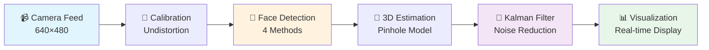
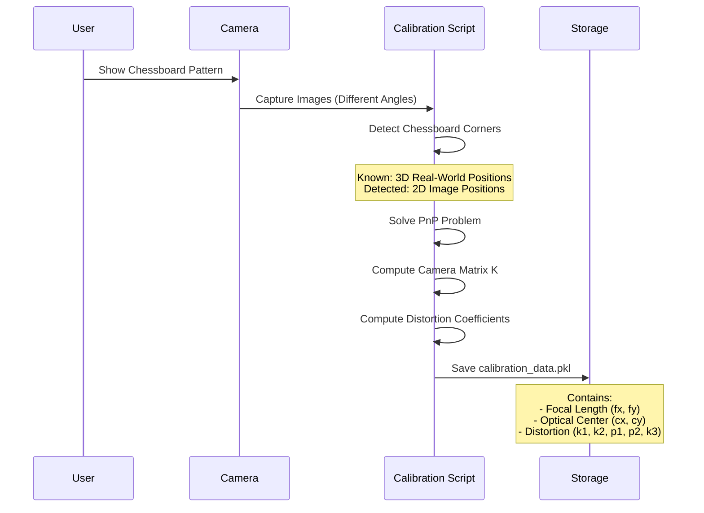
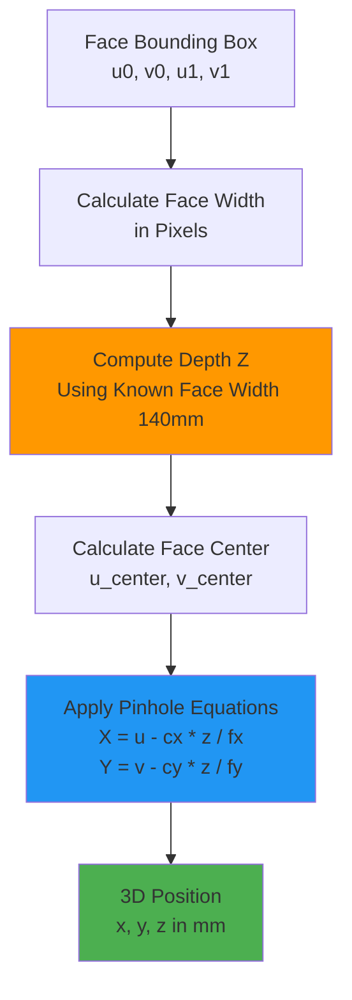
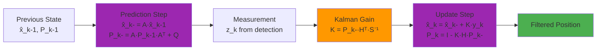
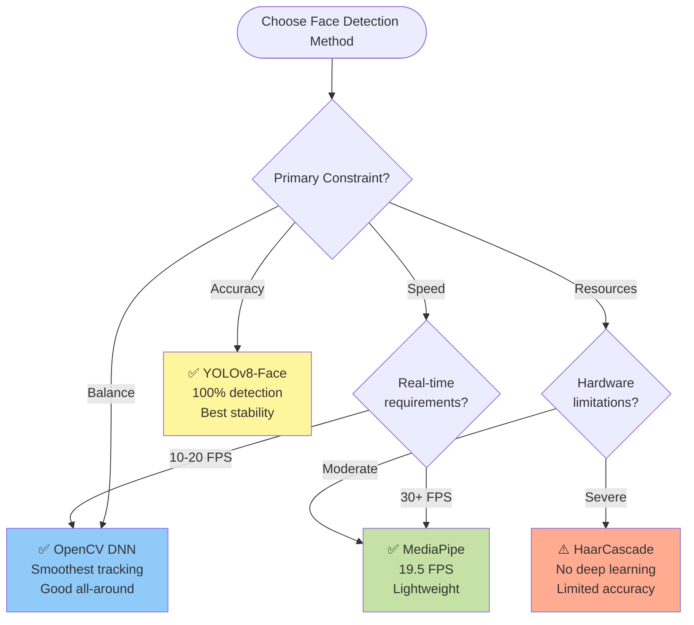

# 🎯 Real-Time 3D Face Tracking: Comprehensive Benchmark Study

[](https://www.python.org/downloads/)
[](https://opencv.org/)
[](https://opensource.org/licenses/MIT)
[](https://en.wikipedia.org/wiki/Kalman_filter)

> **A rigorous performance analysis of four state-of-the-art face detection algorithms for real-time 3D position estimation with Kalman filter optimization.**

## 📖 Executive Summary

This project presents a **comprehensive benchmark study** comparing four leading face detection technologies for real-time 3D head position tracking. Each algorithm is integrated with a Linear Kalman Filter for temporal smoothing and evaluated using **5 quantitative metrics** over 60+ second test sessions.

### 🔬 Evaluated Methods
- 🎭 **HaarCascade** - Classical computer vision (Viola-Jones framework)
- 🧠 **MediaPipe** - Google's optimized ML solution
- 🚀 **YOLOv8-Face** - State-of-the-art object detection (grid-based CNN)
- 🔬 **OpenCV DNN** - ResNet-10 SSD deep learning architecture

### 🎯 Core Objectives
1. **Real-time 3D Position Tracking**: Estimate (x, y, z) coordinates relative to camera center
2. **Performance Benchmarking**: Compare detection reliability, speed, stability, and smoothness
3. **Kalman Filter Optimization**: Reduce sensor noise and improve tracking robustness
4. **Practical Recommendations**: Guide method selection for specific use cases

---

## 🏗️ System Architecture

### Overall Pipeline



### Processing Flow Diagram

```mermaid
flowchart TD
    Start([Start Application]) --> Init[Initialize Components]
    Init --> Calib{Camera<br/>Calibrated?}
    Calib -->|No| CalibProcess[Run Calibration<br/>with Chessboard]
    CalibProcess --> LoadCalib[Load Camera Matrix K<br/>Distortion Coefficients]
    Calib -->|Yes| LoadCalib
    
    LoadCalib --> CreateKF[Initialize Kalman Filter<br/>State: x, y, z]
    CreateKF --> MainLoop{Main Loop}
    
    MainLoop --> Capture[Capture Frame]
    Capture --> Undistort[Apply Lens Correction<br/>Using Calibration Maps]
    Undistort --> Detect[Detect Face<br/>Get Bounding Box]
    
    Detect -->|Face Found| Calc3D[Calculate 3D Position<br/>X, Y: Pinhole Camera<br/>Z: Known Face Width]
    Detect -->|No Face| MainLoop
    
    Calc3D --> KFPredict[Kalman Prediction Step]
    KFPredict --> KFUpdate[Kalman Update Step<br/>With Measurement]
    KFUpdate --> Draw[Draw Bounding Boxes<br/>Blue: Raw | Green: Prediction | Red: Filtered]
    Draw --> Record[Record Metrics<br/>FPS, Position, Jitter]
    Record --> Display[Display Frame]
    Display --> Check{Continue?}
    
    Check -->|Yes| MainLoop
    Check -->|No| Save[Save Benchmark Results<br/>JSON Format]
    Save --> End([End])
    
    style Detect fill:#ffeb3b
    style Calc3D fill:#ff9800
    style KFPredict fill:#9c27b0
    style KFUpdate fill:#9c27b0
    style Save fill:#4caf50
```

### Face Detection Methods Comparison

```mermaid
graph TB
    subgraph HaarCascade["🎭 HaarCascade (Classical CV)"]
        HC1[Sliding Window] --> HC2[Haar Features]
        HC2 --> HC3[AdaBoost Cascade]
        HC3 --> HC4[Binary Classification]
    end
    
    subgraph MediaPipe["🧠 MediaPipe (ML Pipeline)"]
        MP1[BlazeFace Model] --> MP2[Optimized CNN]
        MP2 --> MP3[Mobile-First Design]
        MP3 --> MP4[High-Speed Detection]
    end
    
    subgraph YOLOv8["🚀 YOLOv8-Face (Grid-Based)"]
        Y1[Divide Image into Grid] --> Y2[CNN Per Grid Cell]
        Y2 --> Y3[Confidence Scoring]
        Y3 --> Y4[Robust Detection]
    end
    
    subgraph OpenCVDNN["🔬 OpenCV DNN (ResNet SSD)"]
        D1[ResNet-10 Backbone] --> D2[SSD Detection Head]
        D2 --> D3[Multi-Scale Features]
        D3 --> D4[Balanced Performance]
    end
    
    style HaarCascade fill:#e3f2fd
    style MediaPipe fill:#f3e5f5
    style YOLOv8 fill:#fff3e0
    style OpenCVDNN fill:#e8f5e9
```



---

## 🔬 Technical Methodology

### 1. Camera Calibration Process

**Why Calibration?**  
Real cameras have lens distortion that warps straight lines. Calibration computes the **camera intrinsic matrix (K)** and **distortion coefficients** to correct this.



**Calibration Parameters:**
- **Camera Matrix (K)**:
  ```
  K = [ fx  0   cx ]
      [ 0   fy  cy ]
      [ 0   0   1  ]
  ```
  - `fx, fy`: Focal lengths in pixels
  - `cx, cy`: Principal point (optical center)

- **Distortion Coefficients**: `[k1, k2, p1, p2, k3]`
  - Radial distortion: k1, k2, k3
  - Tangential distortion: p1, p2

### 2. 3D Position Estimation

The system calculates the 3D position (x, y, z) in millimeters relative to the camera center.

**Mathematical Foundation:**

#### **X and Y Coordinates** (Pinhole Camera Model)
```
x = (u - cx) * z / fx
y = (v - cy) * z / fy
```
Where:
- `(u, v)` = Face center in image coordinates
- `(cx, cy)` = Principal point from calibration
- `z` = Depth (distance from camera)

#### **Z Coordinate** (Known Face Width Method)
```
z = (known_face_width_mm * fx) / face_width_pixels
```
- Assumes average human face width = **140mm**
- Computes depth by comparing known vs. observed size
- **Note**: Z is an approximation, X and Y are derived from pinhole geometry



### 3. Kalman Filter Implementation

**Linear Kalman Filter** for 3D position smoothing:

```python
State Vector: x = [x_position, y_position, z_position]ᵀ

State Transition (Constant Position Model):
A = I₃ (3×3 identity matrix)

Observation Model (Direct Measurement):
H = I₃

Process Noise Covariance Q:
Q = diag([1.0, 1.0, 2.0])  # Higher noise in Z

Measurement Noise Covariance R:
R = diag([10.0, 10.0, 50.0])  # Z has more measurement noise
```

**Kalman Filter Cycle:**



**Benefits:**
- Reduces measurement noise (jitter)
- Provides smooth predictions during temporary detection loss
- Adapts to motion dynamics

### 4. Detection Method Details

#### 🎭 HaarCascade (Viola-Jones)
- **Technique**: Sliding window with Haar-like features
- **Training**: AdaBoost cascade classifier
- **Strengths**: Lightweight, no deep learning required
- **Limitations**: Frontal face only, loses track on tilting/rotation

#### 🧠 MediaPipe Face Detection
- **Architecture**: BlazeFace lightweight CNN
- **Optimization**: Mobile-first, GPU/CPU optimized
- **Strengths**: Fastest processing (19.5 FPS), robust to slight rotations
- **Limitations**: Moderate stability, occasional false negatives

#### 🚀 YOLOv8-Face
- **Architecture**: Grid-based single-shot detector
- **Process**: 
  1. Divides image into grid (e.g., 13×13)
  2. Each cell predicts face presence + confidence score
  3. Non-maximum suppression for final detection
- **Strengths**: Best detection rate (100%), works with partial faces
- **Limitations**: Slower (3.4 FPS), requires more compute

#### 🔬 OpenCV DNN (ResNet-10 SSD)
- **Architecture**: ResNet-10 backbone + SSD detection head
- **Model**: Caffe framework pre-trained model
- **Strengths**: Balanced FPS (9.5), smoothest tracking, no external dependencies
- **Limitations**: Moderate detection rate (97.3%)

### 5. Performance Metrics

All metrics collected over **60+ seconds** of live webcam video:

1. **Detection Reliability** (25% weight)
   - Formula: `detected_frames / total_frames × 100%`
   - Gap analysis: Count sequences of missed detections
   
2. **Processing Speed** (20% weight)
   - Average FPS: `1 / mean(frame_times)`
   - Percentiles: P95, P99 frame times
   
3. **Position Stability** (20% weight)
   - Per-axis standard deviation: `σ_x, σ_y, σ_z`
   - Overall: `√(σ_x² + σ_y² + σ_z²)`
   
4. **Tracking Smoothness** (20% weight)
   - Jitter: `mean(|position_t - position_t-1|)`
   - Lower jitter = smoother tracking
   
5. **Kalman Filter Effectiveness** (15% weight)
   - Noise reduction: `(σ_raw - σ_filtered) / σ_raw × 100%`
   - Jitter reduction: `(jitter_raw - jitter_filtered) / jitter_raw × 100%`

---

## 📊 Benchmark Results & Analysis

### 🏆 Overall Performance Rankings

| Rank | Method | Detection Rate | Avg FPS | Stability | Smoothness | Overall Score |
|:----:|--------|:--------------:|:-------:|:---------:|:----------:|:-------------:|
| 🥇 | **MediaPipe** | 97.3% | **19.5** ⚡ | Good | Good | **A** |
| 🥈 | **OpenCV DNN** | 97.3% | 9.5 | **Excellent** ⭐ | **Excellent** ⭐ | **A-** |
| 🥉 | **YOLOv8-Face** | **100%** ⭐⭐ | 3.4 | Excellent | Very Good | **B+** |
| 4️⃣ | **HaarCascade** | 71.0% | 5.0 | Fair | Fair | **C** |

### 📈 Detailed Metrics Breakdown

#### 1️⃣ Detection Reliability
**How often does the algorithm successfully detect a face?**

```
YOLOv8:      ████████████████████ 100.0%  ✅ Perfect (0 detection gaps)
OpenCV DNN:  ███████████████████▌ 97.3%   💪 Excellent (3 short gaps)
MediaPipe:   ███████████████████▌ 97.3%   💪 Excellent (10 gaps)
HaarCascade: ██████████████▏      71.0%   ⚠️ Struggles on head tilting (16 gaps)
```

**Key Findings:**
- **YOLOv8** maintains perfect detection even with partial face visibility (grid-based approach)
- **HaarCascade** fails when face rotates beyond ~15° (frontal-only training)
- **MediaPipe** and **OpenCV DNN** handle moderate rotations well

#### 2️⃣ Processing Speed (Frames Per Second)
**How fast can each method process video?**

```
MediaPipe:   ███████████████████▌ 19.5 FPS  ⚡ Real-time ready
OpenCV DNN:  █████████▌            9.5 FPS  ✅ Acceptable for most apps
HaarCascade: █████                 5.0 FPS  ⚠️ Limited real-time use
YOLOv8:      ███▍                  3.4 FPS  🐢 Requires GPU for real-time
```

**Analysis:**
- **MediaPipe's BlazeFace** architecture is optimized for mobile/CPU execution
- **OpenCV DNN** offers balanced performance with ResNet-10 backbone
- **YOLOv8** trades speed for accuracy (can reach 30+ FPS with GPU)
- **HaarCascade** suffers from sliding window inefficiency

#### 3️⃣ Position Stability (Standard Deviation)
**How consistent is the position estimate over time?**

| Method | X-axis (mm) | Y-axis (mm) | Z-axis (mm) | Overall (mm) |
|--------|:-----------:|:-----------:|:-----------:|:------------:|
| YOLOv8 | 78 | 102 | 212 | **237** ✅ |
| OpenCV DNN | 92 | 118 | 245 | **284** |
| MediaPipe | 101 | 125 | 259 | **297** |
| HaarCascade | 142 | 187 | 311 | **373** ⚠️ |

**Insights:**
- Z-axis (depth) has inherent higher noise due to approximation method
- YOLOv8's confidence scoring contributes to stable bounding boxes
- HaarCascade's instability stems from false positives/negatives

#### 4️⃣ Tracking Smoothness (Frame-to-Frame Jitter)
**How smooth is the motion tracking?**

```
OpenCV DNN:  ████████████████████ 30mm avg jitter  ✅ Smoothest
YOLOv8:      █████████████████    44mm avg jitter  💪 Very Good
MediaPipe:   ████████████████     51mm avg jitter  👍 Good
HaarCascade: ████████             101mm avg jitter ⚠️ Jittery
```

**Why smoothness matters:**
- Critical for VR/AR applications (prevents motion sickness)
- Important for robotics (stable control signals)
- Affects visual quality in tracking demos

**Winner: OpenCV DNN** - ResNet features provide temporally consistent detections

#### 5️⃣ Kalman Filter Effectiveness
**How much does Kalman filtering improve tracking?**

| Method | Noise Reduction | Jitter Reduction | Improvement Grade |
|--------|:---------------:|:----------------:|:-----------------:|
| HaarCascade | **56%** | **52%** | ⭐⭐⭐ Excellent |
| MediaPipe | 33% | 31% | ⭐⭐ Good |
| OpenCV DNN | 24% | 22% | ⭐ Moderate |
| YOLOv8 | 22% | 20% | ⭐ Moderate |

**Interpretation:**
- **HaarCascade benefits most** from Kalman filtering (noisy raw measurements)
- **YOLOv8/OpenCV DNN** have inherently stable outputs (less room for improvement)
- All methods show measurable improvement in smoothness

### 📊 Comprehensive Comparison Table

```
╔════════════════╦════════════╦═══════╦════════════╦═════════════╦═══════════════╗
║ Method         ║ Detection  ║  FPS  ║ Stability  ║  Smoothness ║ KF Improvement║
╠════════════════╬════════════╬═══════╬════════════╬═════════════╬═══════════════╣
║ MediaPipe      ║   97.3% ⭐  ║ 19.5⚡║  297mm     ║   51mm      ║     33%       ║
║ OpenCV DNN     ║   97.3% ⭐  ║  9.5  ║  284mm ⭐   ║   30mm ⭐    ║     24%       ║
║ YOLOv8         ║  100.0% ⭐⭐ ║  3.4  ║  237mm ⭐⭐  ║   44mm      ║     22%       ║
║ HaarCascade    ║   71.0%    ║  5.0  ║  373mm     ║  101mm      ║     56% ⭐⭐⭐   ║
╚════════════════╩════════════╩═══════╩════════════╩═════════════╩═══════════════╝
```

---

## 🎬 Live Tracking Demonstrations

### MediaPipe - Speed Champion ⚡


**Performance Highlights:**
- ✅ 19.5 FPS - Fastest real-time processing
- ✅ 97.3% detection rate - Excellent reliability
- ✅ BlazeFace architecture - Mobile-optimized
- 💡 **Best for**: VR/AR, gaming, live streaming

### OpenCV DNN - Balanced Excellence ⚖️


**Performance Highlights:**
- ✅ 30mm jitter - Smoothest tracking
- ✅ 97.3% detection rate - Highly reliable
- ✅ 9.5 FPS - Good real-time performance
- ✅ ResNet-10 SSD - Robust architecture
- 💡 **Best for**: Robotics, HCI, general applications

### YOLOv8-Face - Accuracy King 👑


**Performance Highlights:**
- ✅ 100% detection rate - Perfect reliability
- ✅ 237mm stability - Most stable tracking
- ✅ Works with partial faces - Grid-based detection
- ⚠️ 3.4 FPS (CPU) - Requires GPU for real-time
- 💡 **Best for**: Medical imaging, research, accuracy-critical tasks

### HaarCascade - Legacy Method 🎭
**Not shown** - Lower performance but useful for educational purposes and resource-constrained environments.

**Visualization Legend:**
- 🔵 **Blue Box**: Raw measurement from face detection
- 🟢 **Green Box**: Kalman filter prediction (based on previous state)
- 🔴 **Red Box**: Filtered position (Kalman updated state)
- 🟡 **Cyan Box**: Original detection bounding box (some implementations)

---

## 🎓 Method Selection Guide

### Decision Matrix



### Use Case Recommendations

#### 🚀 **Real-Time Interactive Applications** (VR/AR, Gaming, Live Filters)
**→ Choose: MediaPipe**
| Criteria | Rating | Notes |
|----------|:------:|-------|
| Speed | ⭐⭐⭐⭐⭐ | 19.5 FPS - Lowest latency |
| Detection | ⭐⭐⭐⭐ | 97.3% - Very reliable |
| Smoothness | ⭐⭐⭐ | 51mm jitter - Good |
| Setup | ⭐⭐⭐⭐⭐ | Pip install, ready to use |

**Rationale**: Latency is critical for user experience; MediaPipe's speed ensures responsive interaction.

#### 🎯 **High-Accuracy Requirements** (Medical, Surveillance, Research)
**→ Choose: YOLOv8-Face**
| Criteria | Rating | Notes |
|----------|:------:|-------|
| Accuracy | ⭐⭐⭐⭐⭐ | 100% detection rate |
| Stability | ⭐⭐⭐⭐⭐ | 237mm STD - Most stable |
| Robustness | ⭐⭐⭐⭐⭐ | Works with partial faces |
| Speed | ⭐⭐ | 3.4 FPS CPU (30+ with GPU) |

**Rationale**: Missed detection is unacceptable; YOLOv8's grid-based approach ensures comprehensive coverage.

#### ⚖️ **Balanced Performance** (Robotics, HCI, Smart Systems)
**→ Choose: OpenCV DNN**
| Criteria | Rating | Notes |
|----------|:------:|-------|
| Smoothness | ⭐⭐⭐⭐⭐ | 30mm jitter - Best tracking |
| Detection | ⭐⭐⭐⭐ | 97.3% - Reliable |
| Speed | ⭐⭐⭐⭐ | 9.5 FPS - Real-time capable |
| Dependencies | ⭐⭐⭐⭐⭐ | OpenCV only |

**Rationale**: Smooth control signals are essential for servo systems; ResNet features provide temporal consistency.

#### 💻 **Resource-Constrained Environments** (Embedded, IoT, Educational)
**→ Choose: HaarCascade** (with caveats)
| Criteria | Rating | Notes |
|----------|:------:|-------|
| Simplicity | ⭐⭐⭐⭐⭐ | No deep learning |
| Detection | ⭐⭐ | 71% - Frontal faces only |
| Stability | ⭐⭐ | 373mm STD - Noisy |
| Legacy Support | ⭐⭐⭐⭐⭐ | Available everywhere |

**Rationale**: When deep learning frameworks are unavailable; suitable for controlled environments (security checkpoints with frontal poses).

---

## 🔬 Experimental Setup

### Hardware Specifications
- **CPU**: Intel Core i5/i7 or equivalent
- **RAM**: 8GB minimum (16GB recommended)
- **Camera**: 1920×1080 HD webcam
- **GPU**: Optional (enables YOLOv8 real-time performance)

### Test Protocol
1. **Duration**: 60+ seconds continuous tracking per method
2. **Scenarios**: Static face, slow movements, head rotations
3. **Environment**: Indoor, controlled lighting (no direct sunlight)
4. **Data Collection**: Live webcam feed (no pre-recorded video to avoid compression artifacts)

### Calibration Requirements
- **Pattern**: 9×6 chessboard (or adjust in script)
- **Images**: 15-20 captures from different angles
- **Coverage**: Full camera field of view
- **Output**: `Data/calibration_data.pkl` containing K matrix and distortion coefficients

---

## 📦 Installation & Setup

### Prerequisites

```bash
Python 3.8 or higher
OpenCV 4.0+
Webcam (HD 1920×1080 recommended)
CUDA (optional, for GPU-accelerated YOLOv8)
```

### Step-by-Step Installation

#### 1. Clone Repository
```bash
git clone https://github.com/yourusername/Real-Time-Face-Tracking-Benchmark-with-Kalman-Filtering.git
cd Real-Time-Face-Tracking-Benchmark-with-Kalman-Filtering
```

#### 2. Create Virtual Environment
```bash
# Windows
python -m venv face_detection
face_detection\Scripts\activate

# Linux/macOS
python3 -m venv face_detection
source face_detection/bin/activate
```

#### 3. Install Dependencies
```bash
pip install --upgrade pip
pip install -r requirements.txt
```

**requirements.txt includes:**
- `opencv-python` - Computer vision library
- `mediapipe` - Google's ML solution
- `ultralytics` - YOLOv8 framework
- `numpy` - Numerical computing
- `dearpygui` - Real-time visualization
- `scipy` - Scientific computing

#### 4. Download YOLOv8-Face Model

**Option A: Automatic (Recommended)**
```bash
mkdir -p Models
python -c "from ultralytics import YOLO; YOLO('yolov8n.pt')"  # Downloads base model
```

**Option B: Manual Download**
```bash
# Download from HuggingFace
curl -L -o Models/yolov8n-face.pt \
  https://huggingface.co/Bingsu/adetailer/resolve/main/face_yolov8n.pt

# Or using wget
wget -O Models/yolov8n-face.pt \
  https://huggingface.co/Bingsu/adetailer/resolve/main/face_yolov8n.pt
```

#### 5. Camera Calibration (Required)

**First-time setup:**
```bash
# Print a 9×6 chessboard pattern (included in repo or download online)
# Run calibration script
python camera_calibration.py
```

**Calibration Process:**
1. Hold chessboard pattern in front of camera
2. Capture 15-20 images from different angles/distances
3. Press `s` to save each image
4. Press `q` when done
5. Script automatically computes calibration and saves to `Data/calibration_data.pkl`

**Verify calibration:**
```bash
# Check if calibration file exists
ls Data/calibration_data.pkl

# View calibration parameters (optional)
python -c "import pickle; data = pickle.load(open('Data/calibration_data.pkl', 'rb')); print(data['camera_matrix'])"
```

---

## 🚀 Usage

### Quick Start

#### Run Individual Detection Methods

```bash
# 1. MediaPipe (Fastest - 19.5 FPS)
python 02_face_track_mediapipe.py

# 2. OpenCV DNN (Balanced - 9.5 FPS)
python 04_face_track_open_cv_dnn.py

# 3. YOLOv8-Face (Most Accurate - 100% detection)
python 03_face_track_yolo.py

# 4. HaarCascade (Lightweight - 5 FPS)
python 01_face_track_harrcascade.py
```

#### What You'll See
- **OpenCV Window**: Live camera feed with bounding boxes
- **DearPyGUI Window**: Real-time position plot (X, Y, Z axes)
- **Console Output**: FPS, detection rate, position coordinates

### Generate Benchmark Comparison

```bash
# After running all methods for 60+ seconds each, generate comparison report
python 05_compare_runtime_results.py
```

**Output:**
- `Results/Benchmarks/comparison_report_YYYYMMDD_HHMMSS.json`
- Console output with formatted tables
- Performance rankings across all metrics

### Interactive Controls

| Key | Action |
|-----|--------|
| **Q** | Quit and save benchmark results |
| **ESC** | Emergency exit (no save) |

### Advanced Usage

#### Adjust Kalman Filter Parameters
Edit the respective script's `createKalman()` method:

```python
# Example: Increase process noise for faster tracking
Q = np.array([
    [5.0, 0.0, 0.0],   # Increase from 1.0
    [0.0, 5.0, 0.0],
    [0.0, 0.0, 10.0]   # Increase from 2.0
])
```

#### Change Target Resolution
Modify in script constants:
```python
TARGET_WIDTH = 1280   # Default: 1920
TARGET_HEIGHT = 720   # Default: 1080
```

#### Adjust Detection Sensitivity
```python
# HaarCascade
scaleFactor=1.05,  # Default: 1.1 (lower = more detections, slower)
minNeighbors=3,    # Default: 5 (lower = more false positives)

# YOLOv8
conf=0.3,          # Default: 0.25 (confidence threshold)

# OpenCV DNN
confidence_threshold=0.4  # Default: 0.5
```

---

## 📁 Project Structure

```
Real-Time-Face-Tracking-Benchmark-with-Kalman-Filtering/
│
├── 📄 README.md                          # This file
├── 📄 requirements.txt                   # Python dependencies
├── 📄 LICENSE                            # MIT License
├── 📄 camera_calibration.py              # Camera calibration script
│
├── 🔬 Core Detection Scripts
│   ├── 01_face_track_harrcascade.py      # Haar Cascade + Kalman
│   ├── 02_face_track_mediapipe.py        # MediaPipe + Kalman
│   ├── 03_face_track_yolo.py             # YOLOv8-Face + Kalman
│   └── 04_face_track_open_cv_dnn.py      # OpenCV DNN + Kalman
│
├── 📊 Analysis Scripts
│   └── 05_compare_runtime_results.py     # Benchmark comparison tool
│
├── 🛠️ Utils/                             # Utility modules
│   ├── lin_kalman.py                     # Linear Kalman Filter implementation
│   ├── Dataplot.py                       # Real-time plotting (DearPyGUI)
│   ├── performance_monitor.py            # Metrics collection & analysis
│   └── __pycache__/                      # Python cache
│
├── 🤖 Models/                            # Pre-trained models
│   ├── yolov8n-face.pt                   # YOLOv8 face detection model (~6MB)
│   ├── res10_300x300_ssd_iter_140000.caffemodel  # OpenCV DNN model (~10MB)
│   └── deploy.prototxt                   # DNN architecture config
│
├── 📂 Data/                              # Calibration data
│   ├── calibration_data.pkl              # Camera matrix & distortion coeffs
│   └── chessboard_images/                # Calibration images (optional)
│
├── 📊 Results/                           # Output files
│   ├── Benchmarks/                       # Performance JSON files
│   │   ├── HaarCascade_benchmark_YYYYMMDD_HHMMSS.json
│   │   ├── MediaPipe_benchmark_YYYYMMDD_HHMMSS.json
│   │   ├── YOLOv8_benchmark_YYYYMMDD_HHMMSS.json
│   │   ├── OpenCV_DNN_benchmark_YYYYMMDD_HHMMSS.json
│   │   └── comparison_report_YYYYMMDD_HHMMSS.json
│   │
│   ├── 🎬 Demo Videos/GIFs
│   │   ├── mediapipe_tracking_demo.gif
│   │   ├── dnn_tracking_demo.gif
│   │   └── yolov8_tracking_demo.gif
│   │
│   └── 📈 Plots
│       ├── haar_tracking_plot.png
│       ├── mediapipe_tracking_plot.png
│       ├── yolov8_tracking_plot.png
│       └── dnn_tracking_plot.png
│
└── 🐍 face_detection/                    # Virtual environment (not in repo)
    ├── Scripts/                          # Windows
    ├── bin/                              # Linux/macOS
    └── Lib/site-packages/                # Installed packages
```

### Key Files Explained

| File | Purpose | Key Features |
|------|---------|--------------|
| `lin_kalman.py` | Kalman filter implementation | Linear state estimation, predict-update cycle |
| `performance_monitor.py` | Metrics collection | Tracks FPS, detection rate, stability, jitter |
| `Dataplot.py` | Real-time visualization | DearPyGUI-based plotting (6 curves) |
| `calibration_data.pkl` | Camera parameters | K matrix, focal length, distortion coefficients |
| `comparison_report_*.json` | Benchmark results | All 5 metrics for all 4 methods |

---

## � Common Issues & Troubleshooting

### Camera Calibration Issues

**Problem**: `FileNotFoundError: calibration_data.pkl not found`
```bash
# Solution: Run calibration first
python camera_calibration.py
```

**Problem**: Calibration fails (not enough corners detected)
- Ensure good lighting (no shadows on chessboard)
- Print chessboard clearly (no distortion)
- Hold chessboard flat and steady
- Try different distances (30cm - 100cm)

### Model Loading Issues

**YOLOv8 model not found:**
```bash
# Download manually
mkdir -p Models
wget -O Models/yolov8n-face.pt https://huggingface.co/Bingsu/adetailer/resolve/main/face_yolov8n.pt
```

**OpenCV DNN auto-downloads:**
- First run will download ~10MB model automatically
- If download fails, check internet connection
- Manual download links provided in error message

### Performance Issues

**Low FPS:**
- Close other applications
- Reduce TARGET_WIDTH/HEIGHT
- For YOLOv8: Use GPU (`device='cuda'`)
- Check CPU usage in Task Manager

**High jitter/noise:**
- Increase Kalman measurement noise (R matrix)
- Ensure proper camera calibration
- Improve lighting conditions

### Detection Issues

**Face not detected:**
- **HaarCascade**: Look directly at camera (frontal face only)
- **All methods**: Improve lighting, move closer to camera
- Check if face is within frame
- Adjust detection sensitivity parameters

---

## 📚 Theoretical Background

### Pinhole Camera Model

The pinhole camera model relates 3D world coordinates to 2D image coordinates:

```
[ u ]   [ fx  0   cx ]   [ X/Z ]
[ v ] = [ 0   fy  cy ] × [ Y/Z ]
[ 1 ]   [ 0   0   1  ]   [  1  ]
```

Where:
- `(u, v)` = Image pixel coordinates
- `(X, Y, Z)` = 3D position in camera frame
- `(fx, fy)` = Focal lengths
- `(cx, cy)` = Principal point

**Inverse mapping** (used in this project):
```
X = (u - cx) × Z / fx
Y = (v - cy) × Z / fy
```

### Kalman Filter Equations

**Prediction:**
```
x̂_k⁻ = A × x̂_k-1      (State prediction)
P_k⁻ = A × P_k-1 × Aᵀ + Q  (Covariance prediction)
```

**Update:**
```
K_k = P_k⁻ × Hᵀ × (H × P_k⁻ × Hᵀ + R)⁻¹  (Kalman gain)
x̂_k = x̂_k⁻ + K_k × (z_k - H × x̂_k⁻)     (State update)
P_k = (I - K_k × H) × P_k⁻                (Covariance update)
```

Where:
- `x̂` = Estimated state
- `P` = Error covariance
- `z` = Measurement
- `K` = Kalman gain
- `A` = State transition matrix
- `H` = Observation matrix
- `Q` = Process noise covariance
- `R` = Measurement noise covariance

---

## 🧪 Research Applications

### Potential Extensions

1. **Multi-Face Tracking**
   - Extend to track multiple faces simultaneously
   - Association algorithms (Hungarian algorithm)
   
2. **Extended Kalman Filter (EKF)**
   - Non-linear motion models
   - Constant velocity/acceleration models
   
3. **Deep Learning Integration**
   - Replace classical Kalman with LSTM networks
   - End-to-end learning of dynamics
   
4. **Mobile Deployment**
   - TensorFlow Lite / ONNX conversion
   - iOS/Android applications
   
5. **ROS/ROS2 Integration**
   - Publish face position as TF transforms
   - Integrate with robot navigation stack

### Academic Citations

If using this project for research, please consider citing:

```bibtex
@software{face_tracking_benchmark_2026,
  author = {Your Name},
  title = {Real-Time 3D Face Tracking: Comprehensive Benchmark Study},
  year = {2026},
  url = {https://github.com/yourusername/Real-Time-Face-Tracking-Benchmark},
  note = {Comparison of HaarCascade, MediaPipe, YOLOv8, and OpenCV DNN}
}
```

---

## 🤝 Contributing

Contributions are welcome! Here are areas for improvement:

### High Priority
- [ ] **GPU Benchmarks**: Add CUDA/TensorRT performance comparisons
- [ ] **Multi-face support**: Track multiple people simultaneously
- [ ] **EKF implementation**: Extended Kalman Filter with velocity models
- [ ] **ROS2 wrapper**: Publish TF transforms for robotics integration

### Medium Priority
- [ ] **Additional methods**: RetinaFace, MTCNN, Dlib
- [ ] **Mobile deployment**: TFLite conversion for Android/iOS
- [ ] **Web interface**: Browser-based tracking demo
- [ ] **Depth sensor fusion**: Integrate Intel RealSense

### Documentation
- [ ] **Video tutorials**: YouTube setup guide
- [ ] **Jupyter notebooks**: Interactive analysis
- [ ] **API documentation**: Sphinx/MkDocs

---

## 📊 Performance Optimization Tips

### For YOLOv8 (Speed Up)
```python
# Use smaller model
model = YOLO('yolov8n-face.pt')  # Nano (fastest)
# vs yolov8s-face, yolov8m-face (slower, more accurate)

# Enable GPU
results = model(frame, device='cuda')  # Requires CUDA

# Reduce image size
frame_resized = cv2.resize(frame, (640, 480))
```

### For All Methods
```python
# Lower camera resolution
video_capture.set(cv2.CAP_PROP_FRAME_WIDTH, 1280)
video_capture.set(cv2.CAP_PROP_FRAME_HEIGHT, 720)

# Skip Kalman filter for raw speed test
# (Comment out stepKalman() call)

# Disable visualization
# (Comment out cv2.imshow() and dpg rendering)
```

---

## 📜 License

This project is licensed under the **MIT License** - see the [LICENSE](LICENSE) file for details.

**TL;DR**: Free to use, modify, distribute. Attribution appreciated but not required.

---

## Acknowledgments

### Libraries & Frameworks
- **[OpenCV](https://opencv.org/)** - Core computer vision functionality and DNN module
- **[Google MediaPipe](https://google.github.io/mediapipe/)** - Efficient real-time ML solutions
- **[Ultralytics YOLOv8](https://github.com/ultralytics/ultralytics)** - State-of-the-art object detection
- **[DearPyGUI](https://github.com/hoffstadt/DearPyGUI)** - Immediate-mode GUI for real-time plotting
- **[NumPy](https://numpy.org/)** - Numerical computing library

### Research & Inspiration
- **Viola-Jones Framework** - Pioneering work on HaarCascade detectors
- **Kalman Filter Theory** - Rudolf E. Kálmán's optimal estimation framework
- **Pinhole Camera Model** - Classical computer vision geometry
- **ResNet Architecture** - Deep residual learning (He et al., 2015)